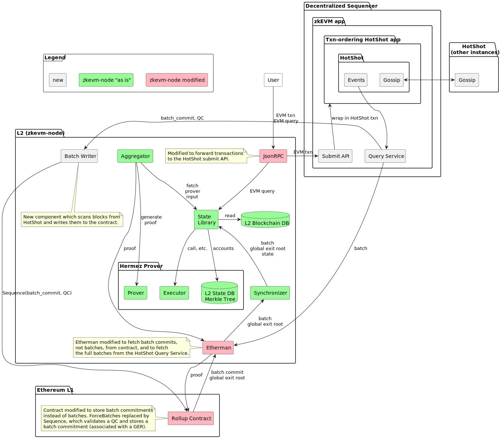
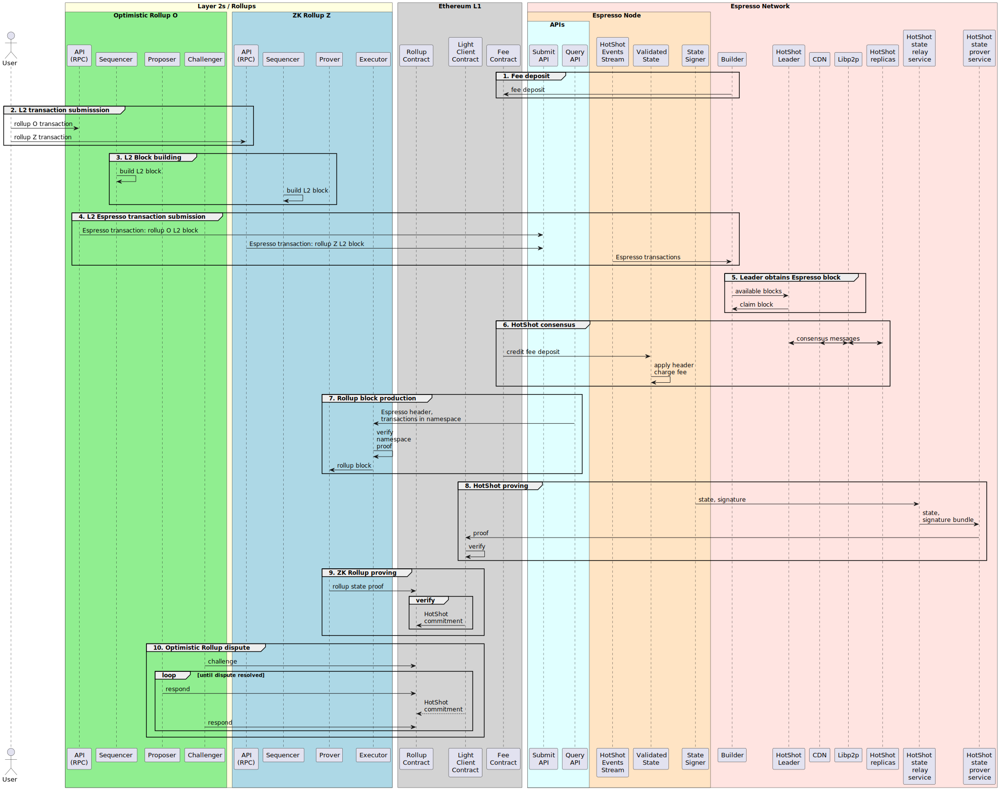

# Espresso Sequencer

[](https://github.com/EspressoSystems/espresso-sequencer/actions/workflows/build.yml)
[](https://github.com/EspressoSystems/espresso-sequencer/actions/workflows/contracts.yml)
[](https://github.com/EspressoSystems/espresso-sequencer/actions/workflows/lint.yml)
[](https://github.com/EspressoSystems/espresso-sequencer/actions/workflows/audit.yml)
[](https://github.com/EspressoSystems/espresso-sequencer/actions/workflows/ubuntu-install-without-nix.yml)
[](https://coveralls.io/github/EspressoSystems/espresso-sequencer?branch=main)

The Espresso Sequencer offers rollups credible neutrality and enhanced interoperability, without compromising on scale.
Consisting of a data availability solution and a decentralized network of nodes that sequences transactions, layer-2
rollups can leverage the Espresso Sequencer to give developers and end users fast confirmations, low (and fair) fees,
and robust infrastructure.

[Official Documentation](https://docs.espressosys.com/sequencer/espresso-sequencer-architecture/readme)

### Architecture

This diagram below depicts a simplified view of the current architecture of the Espresso Sequencer.

- Glossary
  - Namespace: an identifier to distinguish rollups, akin to an Ethereum chain ID
  - Rollup transaction: an transaction a user submits to a rollup, usually an EVM transaction
  - Transaction: a transaction inside the Espresso Sequencer: a rollup transaction plus a namespace ID of the rollup
  - Rollup block: a block in a rollup consisting only of transactions in this rollup
  - Espresso block: a block produced by the Espresso sequencer containing transactions of multiple rollups



The sequence diagram below serves as a complement to the architecture diagram. The following interactions are depicted.

1. Builders deposit funds into the fee contract on Ethereum Layer 1. These funds are later used to pay fees.
2. Users submit transactions to the Submit APIs of sequencer nodes.
3. The leader/proposer obtains a block from a builder.
4. HotShot consensus creates new blocks containing sequenced rollup transactions.
5. A rollup produces a rollup block with transactions sequenced by the Espresso sequencer.
6. A proof for a HotShot state update is created and verified in the Light Client smart contract.
7. A ZK rollup proves a correct state transation by sending a proof to its rollup smart contract.
8. A dispute is settled in an optimistic rollup. If necessary, the HotShot commitment is read from the Light Client
   contract.



# Running the demo

Refer to [sequencer-example-l2](https://github.com/EspressoSystems/sequencer-example-l2) for instructions on how to run
a dockerized Espresso Sequencer network with an example Layer 2 rollup application.

# Development

- Obtain code: `git clone git@github.com:EspressoSystems/espresso-sequencer`.
- Make sure [nix](https://nixos.org/download.html) is installed.
- Activate the environment with `nix-shell`, or `nix develop`, or `direnv allow` if using [direnv](https://direnv.net/).
- For installation without nix please see [ubuntu.md](./doc/ubuntu.md).

## Run the tests

    just pull # to pull docker images
    just test

## Building figures

    make doc

## Building and running

Docker images and the [docker-compose-demo.yaml](docker-compose-demo.yaml) file are provided for convenience. The
Docker-based demo fetches the images from the `ghcr` repository, where they are updated with every push to `main` on
GitHub. For testing uncommitted changes, you can also run the binaries by manually building and running the services.

Build all executables with `cargo build --release`. You may then start a sequencer network. First, start an
orchestrator. Choose a port `$PORT` to run it on and decide how many sequencer nodes `$N` you will use, then run
`target/release/orchestrator -p $PORT -n $N`.

The sequencer will distribute a HotShot configuration to all the nodes which connect to it, which specifies consensus
parameters like view timers. There is a default config, but you can override any parameters you want by passing
additional options to the `orchestrator` executable. Run `target/release/orchestrator --help` to see a list of available
options.

Next, you must launch a `cdn` instance, which is necessary to facilitate consensus.

```bash
just dev-cdn -- -p 1738
```

In this case, we run it on port 1738.

Once you have started the orchestrator and the CDN, you must connect `$N` sequencer nodes to them, after which the
network will start up automatically. To start one node, run

```bash
target/release/sequencer \
    --orchestrator-url http://localhost:$PORT \
    --cdn-endpoint "127.0.0.1:1738"  \
    -- http --port 8083 -- query --storage-path storage -- submit
```

A useful Bash snippet for running `$N` nodes simultaneously in the background of your shell is:

```bash
for i in `seq $N`; do
    target/release/sequencer \
        --orchestrator-url http://localhost:$PORT \
        --cdn-endpoint "127.0.0.1:1738"  \
done
```

For running a full demo natively run `just demo-native`.

### Contracts

#### Development

A foundry project for the contracts specific to HotShot can be found in the directory `contracts`.

To compile

```shell
forge build
```

To run the tests

```shell
forge test
```

In order to avoid constant warnings about checksum mismatches with [svm-rs](https://github.com/roynalnaruto/svm-rs)
managed `solc` we set `FOUNDRY_SRC` to solc installed via flake.nix.

- To use the contracts from rust generate the rust contracts bindings: `just gen-bindings`.
- Bindings are only generated for contracts in the `contracts/src` folder

To generate documentation in `./docs` for solidity code run

```shell
forge doc
```

#### Deployment

To deploy the contracts to a local testnet, first run a dev chain (e.g. `anvil`), then run

    forge script DeployHotShot --broadcast --rpc-url local

To deploy to sepolia set `SEPOLIA_RPC_URL` and `MNEMONIC` env vars and run

    forge script DeployHotShot --broadcast --rpc-url sepolia

To additionally verify the contact on etherscan set the `ETHERSCAN_API_KEY` env var and run

    forge script DeployHotShot --broadcast --rpc-url sepolia --verify

Running the script will save a file with details about the deployment in `contracts/broadcast/$CHAIN_ID`.

#### Folder Structure Rationale

- code for demo purposes goes into the `contracts/demo` folder
- code that eventually ends up in production goes into the `contracts/src` folder

#### Benchmarking and profiling

The gas consumption for updating the state of the light client contract can be seen by running:

```
> just lc-contract-benchmark
cargo build --bin diff-test --release
    Finished release [optimized] target(s) in 0.41s
forge test --mt testCorrectUpdateBench | grep testCorrectUpdateBench
[PASS] testCorrectUpdateBench() (gas: 597104)
```

In order to profile the gas consumption of the light client contract do the following:

1. Set the environment variables `SEPOLIA_RPC_URL`, `MNEMONIC` and `ETHERSCAN_API_KEY`.
2. `just lc-contract-profiling-sepolia`
3. Create an account on [sentio.xyz](https://app.sentio.xyz/).
4. Use the hash of the transaction generated in step two when calling the function `newFinalizedState` in order to
   obtain the gas profile.

## Misc

### Authenticate with GitHub container registry

This is only necessary to fetch private images.

- Go to your github profile
- Developer Settings > Personal access tokens > Personal access tokens (classic)
- Generate a new token
  - for the scope options of the token, tick the _repo_ box.
- Run `docker login ghcr.io --username <you_github_id> --password <your_personal_access_token>`

# License

## Copyright

**(c) 2022 Espresso Systems** `espresso-sequencer` was developed by Espresso Systems. While we plan to adopt an open
source license, we have not yet selected one. As such, all rights are reserved for the time being. Please reach out to
us if you have thoughts on licensing.

# Disclaimer

**DISCLAIMER:** This software is provided "as is" and its security has not been externally audited. Use at your own
risk.

**DISCLAIMER:** The Rust library crates provided in this repository are intended primarily for use by the binary targets
in this repository. We make no guarantees of public API stability. If you are building on these crates, reach out by
opening an issue to discuss the APIs you need.
