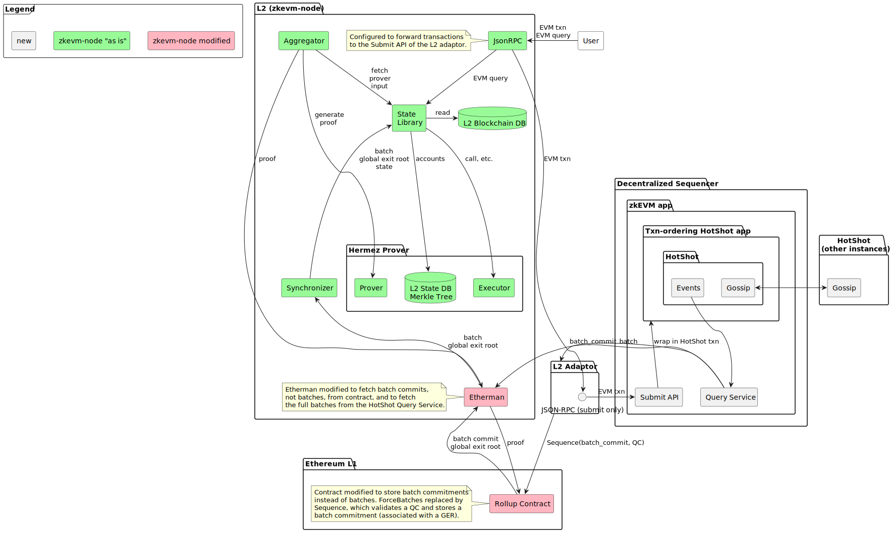

# espresso-sequencer


## Development

- Obtain code: `git clone --recursive git@github.com:EspressoSystems/espresso-sequencer`.
- Make sure [nix](https://nixos.org/download.html) is installed.
- Activate the enviorment with `nix-shell`, or `nix develop`, or `direnv allow`
  if using [direnv](https://direnv.net/).

## Run the tests

    just pull # to pull docker images
    cargo test --all-features

## Building figures

    make doc

## Run the sequencer locally

A sequencer network can be run locally for easy experimentation and testing. Docker images and a
`docker-compose.yaml` are provided for convenience. The Docker-based demo fetches the images from
the `ghcr` repository, where they are updated with every push to `main` on GitHub. For testing
uncommitted changes, you can also run the same demo by manually building and running the services.

### Running with Docker

#### Authenticate with GitHub container registry

* Go to your github profile
* Developer Settings > Personal access tokens > Personal access tokens (classic)
* Generate a new token
  * for the scope options of the token, tick the *repo* box.
* Run ``docker login ghcr.io --username <you_github_id> --password <your_personal_access_token>``

#### Run the demo

To get the latest images: `just pull`

To start the demo: `just demo`. Note: currently broken due to failing genesis
check in the synchronizer.

To start the demo in the background: `just demo-background`. This can be useful because the command should exit sucessfully only once the demo is running.

To stop the demo: `just down`

To build the docker images locally: `just build-docker`. To revert to the CI docker images: `just pull`.

#### Run the integration tests

* ``cargo test --all-features end_to_end``

### Running natively

Build all executables with `cargo build --release`. You may then start a single CDN server and
connect as many sequencer nodes as you'd like. To start the CDN, choose a port `$PORT` to run it on
and decide how many sequencer nodes `$N` you will use, then run
`target/release/cdn-server -p $PORT -n $N`.

The sequencer will distribute a HotShot configuration to all the nodes which connect to it, which
specifies consensus parameters like view timers. There is a default config, but you can override any
parameters you want by passing additional options to the `cdn-server` executable. Run
`target/release/cdn-server --help` to see a list of available options.

Once you have started the CDN server, you must connect `$N` sequencer nodes to it, after which the
network will start up automatically. To start one node, run
`target/release/sequencer --cdn-url tcp://localhost:$PORT`. A useful Bash snippet for running `$N`
nodes simultaneously in the background of your shell is:
```bash
for i in `seq $N`; do
    target/release/sequencer --cdn-url tcp://localhost:$PORT &
done
```

Note: if the sequencer shows a `"Connection refused"` error you may need to use
`127.0.0.1` instead of `localhost` when connecting to the CDN. This is because
`localhost` may resolve to `::1` if dual stack (ipv4 and ipv6) networking is
enabled.

### Developing contracts

A foundry project for the contracts specific to HotShot can be found in the directory `contracts`.

To compile
```shell
forge build
```

To run the tests
```shell
forge test
```

In order to avoid constant warnings about checksum mismatches with
[svm-rs](https://github.com/roynalnaruto/svm-rs) managed `solc` we set
`FOUNDRY_SRC` to solc installed via flake.nix.

### Generating the bindings and deploying Hotshot contracts with Hermez contracts

* Generate the contracts bindings: `cargo run --bin gen-bindings`.
* Edit src/contract-bindings/src/deploy.rs
  * Add reference to new contract binding, e.g. `use crate::bindings::counter::Counter`
  * Add call to `mk_deploy` macro, e.g. `mk_deploy!(ESPRESSO_CONTRACTS_PREFIX,Counter);`

### Working on Hermez contracts in zkevm-contracts

- Ensure submodules are checkout out: `git submodule update --init --recursive`
- Install dependencies `just npm i`
- Compile the contracts `just hardhat compile`
- Update the rust bindings: `cargo run --bin gen-bindings`
- Compile contracts and update bindings: `just update-contract-bindings`
- Run a hardhat dev node: `just hardhat node`
- Update the zkevm-node contract bindings to match zkevm-contracts: `just
  update-zkevm-node-contract-bindings`

## Implementation Plan

We will work towards the architecture illustrated above in three phases.

### Phase I: Basic Sequencing

Replace the Hermez trusted sequencer with a HotShot-based permissionless sequencer.


### Phase II: Off-Chain Data Availability

Only store batch commitments, not full batches, in the rollup contract. Use HotShot for data
availability.



### Phase III: Final Integration

Move adaptor service into zkEVM node for a smoother integration.


