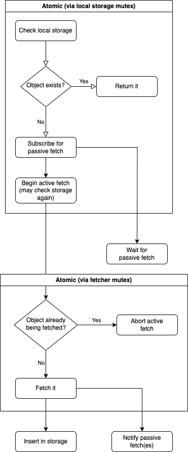
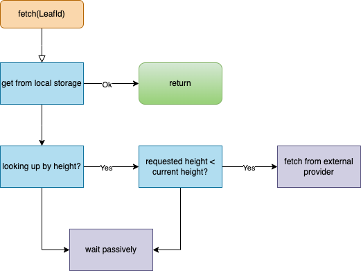

<!--
 ~ Copyright (c) 2022 Espresso Systems (espressosys.com)
 ~ This file is part of the HotShot Query Service library.
 ~
 ~ This program is free software: you can redistribute it and/or modify it under the terms of the GNU
 ~ General Public License as published by the Free Software Foundation, either version 3 of the
 ~ License, or (at your option) any later version.
 ~ This program is distributed in the hope that it will be useful, but WITHOUT ANY WARRANTY; without
 ~ even the implied warranty of MERCHANTABILITY or FITNESS FOR A PARTICULAR PURPOSE. See the GNU
 ~ General Public License for more details.
 ~ You should have received a copy of the GNU General Public License along with this program. If not,
 ~ see <https://www.gnu.org/licenses/>.
 -->

# Asynchronous Data Retrieval

The query service is able to retrieve data from an external data provider when it is missing from
local storage. This could happen, for example, when a particular query node was disconnected from
the network for some time and missed some blocks being finalized, or even when a node was connected
but was not elected by HotShot to be on the DA committee, and thus did not receive the full data for
some blocks.

To support this, the availability data source -- the backend that powers the data availability API
module -- is split into two parts. The **storage** layer implements local storage: a simple database
that supports queries over the two main data structures (blocks and leaves) with various indexes. It
represents a _best effort_ attempt to store and retrieve the data. Any query at any time is allowed
to fail if data is missing. The **provider** layer implements retrieval of data from various
external sources. Both of these layers are abstract, and can have various implementations. We
currently support two implementations of storage -- backed by the local file system, or a Postgres
database -- and one implementation of a provider, which fetches data from a peer query service.

This document will focus on `FetchingDataSource`, which ties these two layers together to provide an
infallible abstraction of HotShot data. Queries made via `FetchingDataSource` will never fail. If
data is not available locally, the data source will transparently retrieve the data from a provider,
and the request will block until the data becomes available.

## Query Interface

The query interface provided by `FetchingDataSource` is designed to support a variety of use cases:
* Requests that should succeed or fail immediately based on whether the data is available locally
* Requests that should block until data becomes available
* Proactive retrieval of missing data to aid future requests

The first two are enabled by the `Fetch` abstraction. `Fetch` is a special kind of future
representing either data that has been retrieved already, or a pending attempt to fetch data. When
awaited, `Fetch` will return immediately when the data is available, or block until it becomes
available. But it is also possible to check if the data is available now and fail if not, using
`Fetch::try_resolve()`.

The uses of `Fetch` can be characterized as "on demand" fetching: we only look for data when asked
for it, and only then do we attempt to fetch it if missing. The query service also supports
proactive fetching, which can limit the impact of missing data on actual clients. This proactive
fetching takes two forms:
1. When a `Fetch` is created in response to an on-demand request, it may spawn a background task to
   actually retrieve the data, [when appropriate](#when-to-fetch). If the `Fetch` is dropped or
   discarded using `try_resolve`, the background task is allowed to continue, and the data will
   still be retrieved. Thus, even if the client that triggered the fetch decides they don't want the
   results, the work we did on their behalf will go on to benefit other clients who later request
   the same resource.
2. A background task periodically scans the database to discover missing data, and manually triggers
   fetches for it. This ensures that even data which is rarely requested will be fetched in good
   time, which in turn reduces the likelihood that a fetch is need if and when that data is finally
   requested. This can reduce the latency of blocking requests and the failure rate of non-blocking
   requests.

## Retrieval and Fetching Workflow

Retrieving data consists of three phases:
* Check for the data in local storage
* If missing, start a passive fetch. We retain a read lock on the local database while starting this
  up, which ensures the data cannot be inserted by another task before we have started the passive
  fetch. Thus, this ensures that the request will complete if any other task ever receives the data.
* Start an active fetch. [If possible](#when-to-fetch), we can take control of our own request and
  actively fetch the data from an external provider. This will then cause our passive fetch to
  resolve. Sometimes this is not possible, in which case we are reliant on the data being fetched
  some other way and resolving the passive fetch.

## When to Fetch

Since clients of the query service can ask for any arbitrary resource, it is not always appropriate
to spawn a request when we don't have the data that is missing. In fact, doing so could lead to
denial-of-service attacks. Imagine the user requests a block by a hash. We check our database and do
not have a block with that hash, so we spawn a task to fetch it from another query service. But they
don't have it either, and so they in turn fetch from another peer, and so on. Now, it turns out that
the requested hash was completely made up -- it does not and will never correspond to any real
block. The malicious client has just caused a number of different nodes to spin up a background task
which will consume resources and never terminate. And they can do this repeatedly!

To guard against this type of attack, we are careful only to fetch a resource from an external
provider when the resource is known to exist. Examples of resources that can be known to exist even
while missing from the local database include
* Blocks _requested by height_ where the height is less than the known block height of the chain
* Blocks requested by hash where we already have a header with the right hash, proving that the full
  block exists somewhere

Requests to external providers for resources that are known to exist are called _active fetches_.
For all other requests, we perform only a _passive fetch_: we simply wait for a resource satisfying
the request to arrive by some other means. In this way, we can still eventually satisfy all valid
requests, while limiting malicious requests to a minimal amount of resources -- essentially only the
resources required to keep open a connection to the client, which in turn can be metered by standard
DDoS prevention techniques.

Note that, due to proactive fetching, all missing resources which actually exist will eventually be
retrieved, and so all non-malicious passive fetches will eventually resolve.

### Active Fetching: Leaves

Leaves can be requested by height or hash. We will only ever trigger an active fetch if requested by
height, since without even a leaf, there is no way for us to tell locally whether a given hash
exists. Note that internally, the query service only ever needs to look up leaves by height (this is
to implement leaf subscriptions, where we start from a height an increment sequentially), so we will
only fail to trigger an active fetch in response to a direct request from the user.

When a leaf is requested by height, and the leaf is not present in local storage, we compare the
requested height to the largest known block height. If less, we can trigger an active fetch for the
leaf, because we know it must exist. If the requested height is greater than the largest known block
height, we will not trigger an active fetch, because the leaf does not exist yet (as far as we
know). We will eventually retrieve all future leaves via our consensus event stream, or failing that
via proactive fetching, so a passive fetch is fine here.

While the active fetch for the leaf happens in a background task and does not effect request
latency, the decision of whether to start an active fetch is on the critical path of request
handling, and so performance is of some concern, as is minimizing load on the local database. For
efficiency, we store the largest known block height in memory, and update it every time a new block
or leaf is seen. In this way, the in-memory block height should always match the block height in
storage, so we can check whether a leaf can be actively fetched without touching storage.

### Active Fetching: Blocks

A block is the combination of a header (contained in the corresponding leaf) and a payload. Thus,
block fetching proceeds in two phases. It is further complicated by the fact that a block can be
requested many ways:
* By height
* By hash
* By payload hash (which is not necessarily unique!)
* By the hash of a transaction contained in the payload (also not unique)

First, we look up the header in local storage, using the same identifier that was used to request
the block. This is useful because even if the full block wasn't available in the database, the
header might be, which could save us a round trip to an external data provider. If the header is not
found, it is fetched, following the rules for fetching leaves. Thus, this may trigger an active
fetch of a leaf (which will contain the desired header), or it may downgrade the active fetch to a
passive one (if the header is not known to exist). In the latter case, the passive fetch will
eventually terminate if and only if the desired header exists.

Once we have obtained a header for the desired block, we know for sure the block exists, and we also
know the hash of its payload. We then start an active fetch for the payload with that hash, which
can be combined with the header to form the block.

Note that the case of requesting a block by the hash of a transaction it contains is a bit
complicated. For the other three cases (requesting by hash, height, or payload hash), we can always
at least try to look up the header locally, because those three fields are contained in the header,
and we have indexes for them. But there is no way to tell, without having the payload already,
whether a certain block contains a given transaction, or what its header should be. Thus, this case
_always_ leads to a passive fetch, and as long as the client request is alive, we must check every
incoming block for the desired transaction.

## Authentication of Fetched Data

Data retrieved from external data providers is considered untrustworthy until verified. When
fetching leaves or headers, we need to actually verify HotShot consensus, to determine that the leaf
is finalized at a given height (leaves are always fetched by height). This requires us to download a
chain of leaves proving that a certain application state is finalized, as well as an
application-specific proof showing that the desired leaf is in the history of the finalized leaf. In
a special case, the desired leaf may be identical to the finalized leaf, and the extra proof can be
omitted.

Payloads are easier to verify. They are always fetched by hash, so we can simply recompute the hash
of the fetched payload and compare it to the desired hash.
