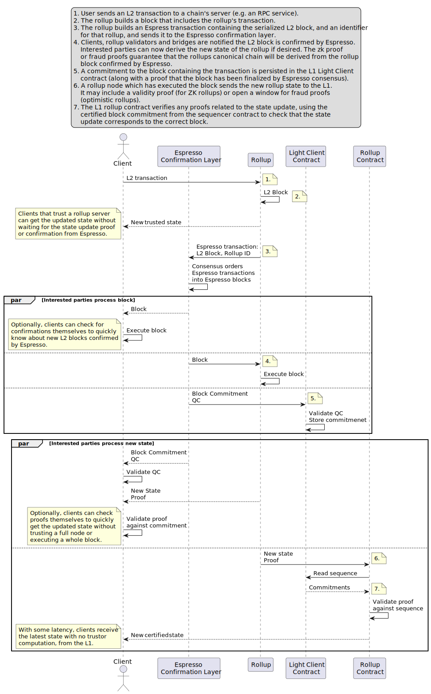

# Espresso Confirmation Layer Architecture

## Overview

The diagram below shows how the Espresso Confirmation Layer fits into the rollup
centric Ethereum ecosystem.

1. Many clients submit transactions to each L2 simultaneously (for clarity only
   one rollup is depicted in detail).
2. The rollup sequencer or block builder builds a block with L2 transactions.
3. L2 forwards L2 block to the confirmation layer.
4. Espresso produces Espresso blocks containing rollup namespaces with confirmed
  rollup blocks. L2 validators receive blocks and execute the state transition
  functions for their rollups.
5. Espresso posts succinct commitment to block to L1. Contract verifies proof of
  Espresso state transition then stores the block commitment.
6. Rollups post updated state to L1. ZK-rollups include a proof.
7. Rollup contracts read certified sequence of block commitments from sequencer
  contract. Verify state transition proofs against this sequence (ZK-rollup) or
  wait for fraud proof against this sequence (optimistic rollup).

Below is sequence diagram to accompany the overview:

1. User sends an L2 transaction to a chain's server (e.g. an RPC service).
2. The rollup builds a block that includes the rollup's transaction.
3. The rollup builds an Espress transaction containing the serialized L2 block,
    and an identifier for that rollup, and sends it to the Espresso confirmation
    layer.
4. Clients, rollup validators and bridges are notified the L2 block is confirmed
    by Espresso. Interested parties can now derive the new state of the rollup
    if desired. The zk proof or fraud proofs guarantee that the rollups
    canonical chain will be derived from the rollup block confirmed by Espresso.
5. A commitment to the block containing the transaction is persisted in the L1
    Light Client contract (along with a proof that the block has been finalized
    by Espresso consensus).
6. A rollup node which has executed the block sends the new rollup state to the
    L1. It may include a validity proof (for ZK rollups) or open a window for
    fraud proofs (optimistic rollups).
7. The L1 rollup contract verifies any proofs related to the state update, using
    the certified block commitment from the sequencer contract to check that the
    state update corresponds to the correct block.

## Espresso Confirmation Layer

This diagram below depicts a simplified view of the current architecture of the
Espresso Confirmation Layer. The diagram includes views of an Espresso node, the
Espresso Network (nodes, CDN, builders, prover, state relay service), two
rollups (one ZK rollup "Z", one optimistic rollup "O") that use the Espresso
Sequencer for sequencing and some important L1 contracts.

- Glossary
  - Namespace: an identifier to distinguish rollups, akin to an Ethereum chain
    ID
  - Rollup transaction: a transaction a user submits to a rollup, usually an EVM
    transaction
  - Transaction: a transaction inside the Espresso Sequencer: a rollup
    transaction plus a namespace ID of the rollup
  - Rollup block: a block in a rollup consisting only of transactions in this
    rollup
  - Espresso block: a block produced by the Espresso sequencer containing
    transactions of multiple rollups

The sequence diagram below serves as a complement to the architecture diagram.
The following interactions are depicted.

1. Builders deposit funds into the fee contract on Ethereum Layer 1. These funds
   are later used to pay fees.
2. Users submit L2 transactions to the rollup RPCs.
3. The rollups build L2 / rollup blocks.
4. The rollups send their L2 blocks to the Espresso confirmation layer.
5. The leader/proposer obtains a block from a builder.
6. HotShot consensus creates new blocks containing sequenced rollup
   transactions.
7. A rollup produces a rollup block with transactions sequenced by the Espresso
   sequencer.
8. A proof for a HotShot state update is created and verified in the Light
   Client smart contract.
9. A ZK rollup proves a correct state transaction by sending a proof to its
   rollup smart contract.
10. A dispute is settled in an optimistic rollup. If necessary, the HotShot
   commitment is read from the Light Client contract.

