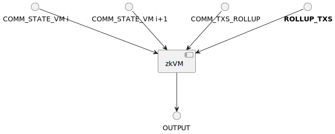
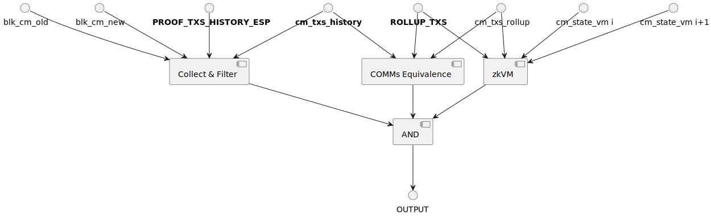
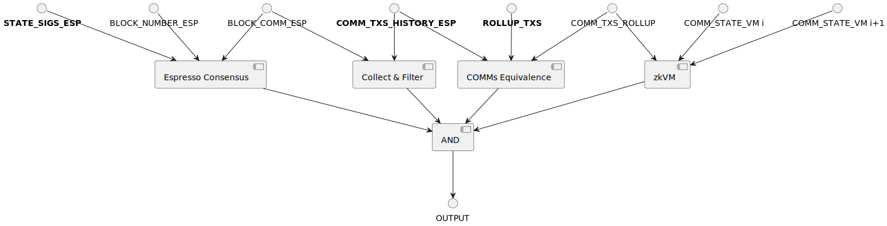

# Integration with ZK rollups

## Background

> For more context and terminology about the architecture of Espresso, please read [README.md](../README.md).

At a high level ZK rollups produce blocks and periodically settle their new state on layer 1 (e.g. Ethereum), after
applying all the transactions of such blocks to their current state. The time between two consecutive updates can vary,
yet it is high enough in order to amortize gas costs for the rollup and thus offer low fees to end users. ZK rollups
have the option to build their blocks by reading from HotShot, the Espresso consensus protocol, that produces blocks
containing transactions from multiple rollups. In this setting each rollup is identified by an identifier called
_namespace_. Moreover, HotShot generates an authenticated piece of data, the _finality gadget_, that guarantees that a
specific state of the Espresso ledger will not be reverted. ZK rollups can leverage this finality gadget and a scheme to
filter transactions by namespace in order to prove their source of transactions is the Espresso ledger. Note that in
this document we will not refer to the Espresso market place that allows rollups to sell their sequencing rights to
other parties. Hence, in the following we focus only on the interaction between the rollup and the Espresso consensus
protocol once some Espresso block is appended the ledger.

## Integration approaches

Similarly to their optimistic alternatives, ZK rollups need to instantiate their derivation pipeline in order to
integrate with Espresso. There are a number of alternatives for such integration, depending on specific constraints the
rollup may have such as using a particular data availability layer in addition to Tiramisu, or the need to update their
state on the L1 at a faster pace than the Espresso light client contract does.

As described in the [sequence diagram](../README.md#Architecture), zk rollups relying on Espresso blocks as their source
of transactions have to prove their state update is consistent with the Espresso state. This can be achieved in two
ways:

1. The rollup relies on the Espresso light client contract to fetch the Espresso state updates.
2. The rollup verifies some value equivalent to the Espresso finality gadget inside its circuit.

Moreover, in case the Espresso consensus looses liveness, and thus the corresponding finality gadget is not available,
the rollup can fall back to a backup sequencer. In order to reliably detect that the Espresso consensus is not making
progress, the rollup contract will call an escape hatch function part of the Espresso light client contract.

For both alternatives we describe:

- the high level structure of the circuit as well as the rollup L1 contract and how they are related.
- how rollups use the escape hatch function of the Espresso light client contract to source the transactions from the
  backup sequencer.

For rollups relying exclusively on a centralized sequencer (such as most current production deployments today), the
circuit only checks the correct update of the zkVM as depicted in Figure 1. Naturally this same circuit can be used when
the escape hatch is activated, as in this case the backup sequencer is in control of the rollup operator. When the
escape hatch is not activated, because the Espresso consensus is making progress, the circuit depicted in Figure 1 needs
to be extended with additional gadgets in order to guarantee the transactions are fetched from the Espresso ledger
instead of some trusted / local source.



**Figure 1:** Circuit used when the rollup falls back to using its default (centralized) sequencer. The public inputs
are the current state of the rollup _COMM_STATE_VM i_, the new rollup state after update _COMM_STATE_VM i+1_ and a
commitment to the transactions applied to the state, _COMM_TXS_ROLLUP_. The private input (in bold) corresponds to the
list of transactions.

## Rollup Contract

The rollup contract allows rollups to settle their state on layer 1 (Ethereum) via the verification of a snark proof.
The abstract version of this contract is sketched below. In addition to contract variables and a constructor, it
contains a function `isEscapeHatchActivated` which allows to detect whether the Espresso consensus protocol is live or
not. In case liveness is lost, the rollup can update its state without reading from the Espresso ledger by calling the
function `updateStateDefaultSequencingMode`. Note that the Espresso state is read from the Espresso light client
contract which is referenced by the rollup contract via the variable `lcContract`.

```solidity
// Abstract rollup contract
contract RollupContract {

    VMState previousVMState;
    EspressoState previousEspressoState;
    uint256 lastEspressoBlockNumber;
    LightClient lcContract;
    bytes[] vkRollup; // This verification key corresponds to the circuit depicted in Figure 1.
    bytes[] vkEspresso; // This verification key corresponds to the circuits depicted in Figure 2 or 3.
    uint256 escapeHatchThreshold; // Number of L1 blocks the Espresso light client contract is allowed to lag behind in order to consider the Espresso consensus is still live.

    constructor(address EspressoLightClientAddress,...) public {
        lcContract = LightClient(EspressoLightClientAddress);
        ...
    }

    /// Detects if the escape hatch is activated or not.
    function isEscapeHatchActivated() private returns (bool) {
        if (lcContract.getFinalizedState().blockHeight > lastEspressoBlockNumber){
            return false;
        } else {
            return lcContract.lagOverEscapeHatchThreshold(block.number, escapeHatchThreshold);
        }
    }

    /// Updates the state of the rollup if the Espresso finality gadget looses liveness.
    function updateStateBackupSequencingMode(commTxsRollup, newVMState) virtual {
      bytes[] publicInputs = [
        previousVMState,
        newVMState,
        commTxsRollup,
      ];

      SnarkVerify(
        publicInputs,
        snarkProof,
        vkRollup);

      previousVMState = newVMState;
    }


    // Update the rollup state using the Espresso ledger as input.
    function updateStateFromEspresso(
        newEspressoState,
        blockNumberEspresso,
        commTxsRollup,
        newVMState,
        snarkProof) virtual {

        if (blockNumberEspresso <= lastBlockNumberEspresso) {
          revert();
        }

        bytes[] publicInputs = [
          previousVMState,
          newVMState,
          commTxsRollup,
          previousEspressoState,
          newEspressoState,
          lastEspressoBlockNumber,
          blockNumberEspresso
        ];

        SnarkVerify(
          publicInputs,
          snarkProof,
          vkEspresso
        );

        previousEspressoState = newEspressoState;
        lastBlockNumberEspresso =  blockNumberEspresso;

        previousVMState = newVMState;
    }

    // Main function to update the rollup state. Specific to the type of integration (see below)
    function updateRollupState(...
        ){
        ...
    }
}
```

## Integration 1: Rollup contract fetches Espresso block commitment from the Espresso light client contract

For this integration, Espresso consensus verification is delegated to the Espresso light client contract. In practice
the rollup contract will be given the last Espresso block commitment and feed it to the circuit. Still additional
gadgets need to be introduced in order to implement the derivation pipeline logic consisting at a high level of:

- Collecting all the Espresso commitments since the last update.
- For each of these commitments, filter the corresponding Espresso blocks in order to obtain the transactions belonging
  to the rollups.
- Establishing some equivalence between the commitment to the rollup transactions used in the zkVM and the commitment to
  those same transactions obtained after namespace filtering.

 **Figure 2:** Rollup circuit with additional gadgets _Collect &
Filter_, and _COMMs Equivalence_. Private inputs of the circuit are written in bold font.

The circuit depicted in Figure 2 operates as follows:

- The _Collect & Filter_ gadget receives as input _blk_cm_new_ which is the commitment to the latest Espresso block
  available and _blk_cm_old_. Both of these commitments are public inputs. The first witness of this circuit is
  _cm_txs_history_ESP_ which is a commitment to all the rollup transactions that have been sequenced since the last
  Espresso state update _blk_cm_old_. The relationship between _blk_cm_new_, _blk_cm_old_, and _cm_txs_history_ can be
  checked using a second witness _proof_txs_history_. This gadget is required in order to ensure that for each Espresso
  block in the range defined by _blk_cm_old_ and _blk_cm_new_, the transactions applied to the rollup state correspond
  to the rollup namespace. The value _proof_txs_history_ contains a list of namespace proofs, one for each Espresso
  block in the range. Note that such list of proofs could be aggregated or verified in batch depending on the commitment
  scheme used to represent each Espresso block.
- The _COMMs Equivalence_ gadget checks that using the same rollup inputs _ROLLUP_TXS_, we obtain _cm_txs_history_ using
  the Espresso commitment scheme for representing a set of transactions and the commitment _cm_txs_rollup_ that is used
  the by _zkVM_ gadget. This gadget is required in order to ensure that the set of transactions fetched from the
  Espresso blocks and represented as _cm_txs_history_ is consistent with the set of transactions applied to the rollup
  state and represented by the commitment _cm_txs_rollup_. Note that if both commitment schemes (used in Espresso and
  the Rollup) were the same, this gadget would not be necessary. Thus, if updating the zkVM circuit is possible in
  practice, by using the Espresso commitment scheme inside the zkVM gadget, one can remove the need for the _COMMs
  Equivalence_ gadget.
- The _zkVM_ gadget is the original gadget of the rollup circuit that proves a correct transition from state
  _cm_state_vm i_ to the next state _cm_state_vm i+1_ when applying the transactions represented by the commitment value
  _COMM_TXS_ROLLUP_.
- These three gadgets above return a boolean: true if the verification succeeds and false otherwise.
- For the circuit to accept, all these gadget outputs must be true, and thus we add an _AND_ gate.

The pseudocode of the rollup contract below shows that in the case we rely on the Espresso light client contract to
fetch the Espresso state, the only inputs to the function `updateRollupState` are `newVMState`, `commTxsRollup` and
`snarkProof`.

```solidity
/// Uses the Espresso light client contract to fetch the last state.
contract RollupContract1 is RollupContract {

    function updateRollupState(
        newVMState,
        commTxsRollup,
        snarkProof){

        // Escape hatch is activated, switch to default sequencing mode
        if (isEscapeHatchActivated()){
            this.updateStateBackupSequencingMode(commTxsRollup);
        } else { // No escape hatch, use the state of Espresso consensus
            lightClientState = lcContract.getFinalizedState();
            newEspressoState = lightClientState.blockCommRoot;
            blockNumberEspresso = lightClientState.blockHeight;
            this.updateStateFromEspresso(newEspressoState, blockNumberEspresso, commTxsRollup, newVMState, snarkProof);
        }
    }
}
```

## Integration 2: Verify Espresso consensus inside the rollup circuit

 **Figure 3:** Rollup circuit with additional gadgets _Espresso Consensus_, _Collect &
Filter_, and _COMMs Equivalence_. Private inputs of the circuit are written in bold font.

The circuit depicted in Figure 3 operates as follows:

- The _Espresso Consensus_ gadget checks that the block commitment for Espresso block _BLOCK_NUMBER_ is _blk_cm_, using
  the multi-signature _STATE_SIGS_.
- The _Collect & Filter_ gadget receives as input _blk_cm_new_ which is the commitment to the latest Espresso block
  available and _blk_cm_old_. Both of these commitments are public inputs. The first witness of this circuit is
  _cm_txs_history_ which is a commitment to all the rollup transactions that have been sequenced since the last Espresso
  state update _blk_cm_old_. The relationship between _blk_cm_, _blk_cm_old_, and _cm_txs_history_ can be checked using
  a second witness _PROOF_TXS_HISTORY_.
- The _COMMs Equivalence_ gadget checks that using the same rollup inputs _ROLLUP_TXS_, we obtain _cm_txs_history_ using
  the Espresso commitment scheme for representing a set of transactions and the commitment _cm_txs_rollups_ that is used
  the by _zkVM_ gadget.
- The zkVM gadget is the original gadget of the rollup circuit that proves a correct transition from state _cm_state_vm
  i_ to the next state _cm_state_vm i+1_ when applying the transactions represented by the commitment value
  _cm_txs_rollup_.
- These three gadgets above return a boolean: true if the verification succeeds and false otherwise.
- For the circuit to accept, all these gadget outputs must be true, and thus we add an _AND_ gate.

The pseudocode of the rollup contract below shows that in the case we do not rely on the Espresso light client contract
to fetch the Espresso state, the function `updateRollupState` requires additional inputs (compared to Integration 1)
which are `newEspressoState` and `blockNumberEspresso`.

```solidity

/// Does not use the Espresso Light client contract for fetching the Espresso state
contract RollupContract2 is RollupContract {

  function updateRollupState(
    newEspressoState,
    blockNumberEspresso,
    newVMState,
    commTxsRollup,
    snarkProof){

    // Escape hatch is activated, switch to default sequencing mode
    if (isEscapeHatchActivated()){
      this.updateStateBackupSequencingMode(commTxsRollup);
    } else { // No escape hatch, use the state of Espresso consensus
      this.updateStateFromEspresso(newEspressoState, blockNumberEspresso, commTxsRollup, newVMState, snarkProof);
    }
  }
}
```
