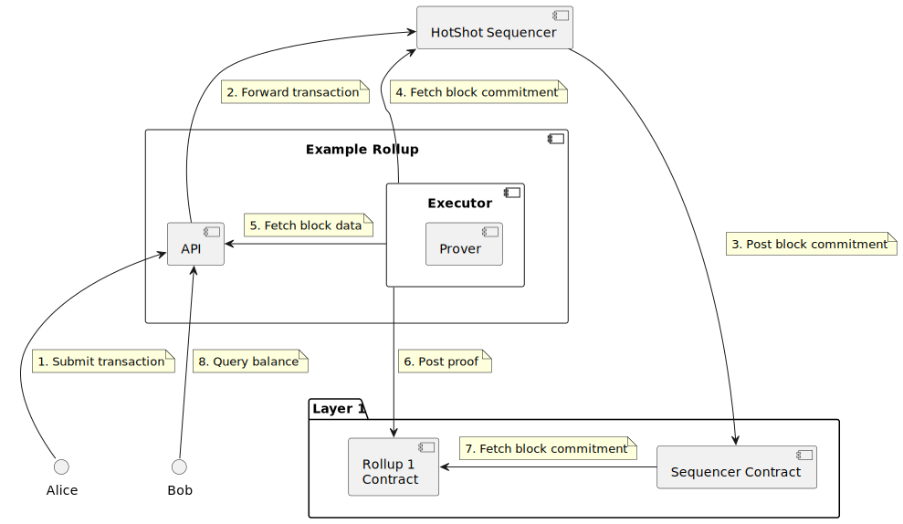

# Example Rollup Documentation

This repository contains an example rollup that integrates with the Espresso Sequencer. The example rollup represents a
simple key/value account store that receives ordered transactions from Espresso, executes them in the rollup VM, and
publishes mock state proofs to an L1 (Ethereum) smart contract. The rollup contains a simple API for submitting
transactions and querying account balances.

## Introduction

The Espresso Sequencer is a decentralized platform that orders transactions intended for rollups, relying on a
[HotShot](https://github.com/EspressoSystems/HotShot) network that achieves consensus on batches of rollup transactions.
At a high level, a rollup is an L1 scaling solution that performs expensive computations off chain. In the case of
zkRollups, a prover periodically submits rollup state checkpoints along with batch proofs of transaction validity to the
L1. The example illustrated here is a mock zkRollup. To learn more about the Espresso Sequencer and different types of
rollups, read our [blog post](https://hackmd.io/@EspressoSystems/EspressoSequencer)) or
[technical documentation](https://docs.espressosys.com/sequencer/espresso-sequencer-architecture/readme).

## Running the Example

### Prerequisites

Ensure `docker` is installed on your system.

For linux distributions follow official instructions of your linux distribution or see
[the official docker instructions](https://docs.docker.com/engine/install/).

On MacOS the most convenient way to install docker is via:

    brew install colima docker docker-compose
    colima start

On Windows follow these steps instead.

1. Install WSL.
2. Install Docker Desktop.
3. Run all the commands below in a WSL shell. To start a WSL shell run wsl in a PowerShell prompt.

Note that we haven't tested on windows, please open an issue if you're running into problems.

### With Docker

1. Pull the latest version of the demo: `docker compose pull`
2. Start the demo: `docker compose up`. Alternatively, to start a fresh demo from scratch run
   `docker compose up --force-recreate`.
3. Stop the demo: `docker compose down`

### Natively

Make sure nix is installed. See instructions [here](https://github.com/EspressoSystems/espresso-sequencer#development).

1. Build all executables: `cargo build --release`
2. Run the cdn: `just dev-cdn`
3. Run the sequencer: `just dev-sequencer`
4. Run a test Anvil node: `just anvil`
5. Once the Sequencer HotShot network is running (there is a 10 second delay), run the demo: `just dev-demo`

### Interacting with the Demo

## CLI

We have built a simple CLI to interact with the demo using a few preseeded identities (Alice, Bob, Charlie). With the
CLI, you can perform asset transfers and check balances. With the demo running, open another terminal and try
transferring some dummy tokens:

```console
> scripts/cli check-balance Alice
Balance of 0x885ee92eebda03540066a25a57cc625bbee15d5a: 9999

> scripts/cli transfer Alice Bob 1000
Submitting Transaction to Rollup API: Transferring 1000 tokens from 0x885e…5d5a to 0xf236…69ca

> scripts/cli check-balance Alice
Balance of 0x885ee92eebda03540066a25a57cc625bbee15d5a: 8999
```

Run `scripts/cli --help` for more information. If you are running the demo natively replace `scripts/cli` with
`just cli`.

## Curl

With the demo running, navigate to http://localhost:8082/ for API documentation.

1. Query the genesis account balance:

```
curl http://localhost:8082/rollup/balance/0xf23694f9c6d4837fc596c4eb7c3c3d8a8bae69ca
```

2. Send tokens to `0x885ee92eebda03540066a25a57cc625bbee15d5a`:

```
curl -X POST -H "Content-Type: application/json" http://localhost:8082/rollup/submit -d "{\"transaction\":{\"amount\":100,\"destination\":\"0x885ee92eebda03540066a25a57cc625bbee15d5a\",\"nonce\":1},\"signature\":{\"r\":\"0x61395b25cf41321bc1242ec301c0aa5a5e5ff47b697f80119a20ce3e5be66f9e\",\"s\":\"0x447cf03a5ddb28b9a189d108a8e91efa523fd3fb37cebab1cad610d82a8edbb0\",\"v\":27}}"
```

3. Query `0x885ee92eebda03540066a25a57cc625bbee15d5a` balance:

```
curl http://localhost:8082/rollup/balance/0x885ee92eebda03540066a25a57cc625bbee15d5a
```

## Transaction Lifecycle

The diagram below represents the lifecycle of a single rollup transaction, illustrating how the example rollup interacts
with the Espresso sequencer along the way. The diagram below is a simplified version of this
[system overview](https://docs.espressosys.com/sequencer/espresso-sequencer-architecture/system-overview), focusing on a
single example rollup transaction.



1. Alice signs a transaction transferring rollup tokens to Bob. Alice sends this transaction to the Rollup through the
   `submit` endpoint of the rollup API. If Alice is concerned about censorship, she can send her transaction directly to
   the sequencer.
2. The rollup API server forwards the transaction to the sequencer. The transaction is tagged with the rollup’s unique
   VM ID so that the rollup can identify its own transactions in step 4.
3. The sequencer network processes the transaction, eventually including it in a block. A sequencer node submits the
   block commitment to a contract on the L1, which verifies that consensus has been reached on the block.
4. The executor service receives notification of the new block commitment via a subscription to a query service provided
   by a sequencer node.
5. The executor fetches transaction data from the sequencer. The transaction data is returned with a namespace proof
   that the set of transactions is complete for the rollup namesapce, along with an
   [NMT root](https://github.com/celestiaorg/nmt). The executor verifies that the NMT root is consistent with the block
   commitment from the sequencer contract. The executor then
   [processes](https://github.com/EspressoSystems/espresso-sequencer/blob/main/example-l2/src/state.rs#L158) the
   transactions, performing the following steps:
   1. The executor applies transactions to the VM state. Before application, each transaction is validated, and invalid
      transactions are discarded (a real rollup would eventually include proofs of transaction invalidity). In our case,
      the block contains a single transaction from Alice to Bob. Since the transaction contains a valid signature and
      Alice has sufficient balance, the transaction is successfully applied and balances are updated.
   2. After transaction application, the executor updates the VM state with the new block commitment and previous state
      commitment.
   3. The executor computes a new state commitment, and generates a mock proof that the state was updated correctly with
      respect to the HotShot block commitment.
6. The executor posts the proof to the rollup contract.
7. The rollup contract verifies the proof by querying the latest certified block commitment from the sequencer contract.
   If the proof is valid, the contract updates its state commitment.
8. Bob queries his balance using the the rollup API, and sees that he has received some new tokens. If this were a real
   rollup, a potentially distrustful Bob could verify his balance against the rollup contract state commitment (the
   example does not currently include this feature).

## Rollup Architecture

**[Rollup State](https://github.com/EspressoSystems/espresso-sequencer/blob/main/example-l2/src/state.rs)**

The state of the example rollup consists of:

- **Accounts**: A mapping of ECDSA (EVM-style) addresses to balances of a dummy token.
- **NMT commitment**: A cryptographic commitment to the latest transaction NMT.
- **Previous state commitment**: A cryptographic commitment to the state of the rollup prior to the most recent
  execution step.
- **VM**: Information about the Rollup VM. Right now, this is a simple ID.

**[Executor](https://github.com/EspressoSystems/espresso-sequencer/blob/main/example-l2/src/executor.rs)**

The executor is a service responsible for subscribing to block commitments posted to the L1 contract, applying
transactions to the rollup state, and submitting
[mock proofs](https://github.com/EspressoSystems/espresso-sequencer/blob/main/example-l2/src/prover.rs) to the rollup
contract. Rollups often separate the roles of executor and prover into two distinct services, but this example combines
them for the sake of simplicity.

**[Rollup API](https://github.com/EspressoSystems/espresso-sequencer/blob/main/example-l2/src/api.rs)**

The rollup API is a REST API that includes a `submit` and `query` endpoint. With the containerized example rollup
running, visit http://localhost:8082/ for API documentation.

**[Rollup Contract](https://github.com/EspressoSystems/espresso-sequencer/blob/main/contracts/src/ExampleRollup.sol)**

The rollup contract stores the most recent rollup state commitment. The contract updates the state commitment when it
receives a valid state transition proof from the executor.
